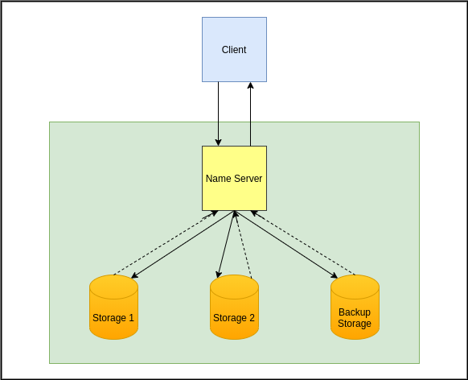
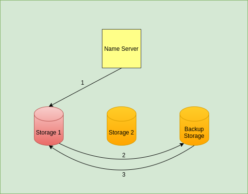
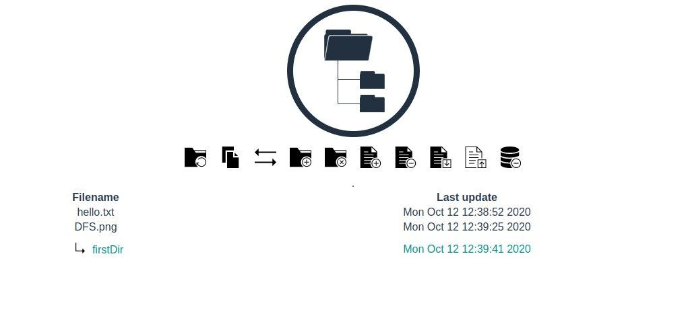

# Project 2: Distributed File System

### Background Information

#### Group Description

1. Alina Bogdanova (B18-SE-02)
2. Nikita Dubina (B18-SB-01) 
3. Rufina Sirgalina (B18-DS-02)

#### Repositories

- [GitHub Repository](https://github.com/MefAldemisov/DistributedFileSstem)
- [DockerHub Repo: Name server](https://hub.docker.com/repository/docker/rrufina/dfs-nameserver)
- [DockerHub Repo: Storage server](https://hub.docker.com/repository/docker/rrufina/storage)
- [DockerHub Repo: Client](https://hub.docker.com/repository/docker/rrufina/dfs-front)

### Task Description

The goal of the project was to implement our own distributed file system.
The file system should support certain directory and file operations. Files should be replicated on multiple storage servers. DFS should be fault-tolerant and the data should be accessible even if some of the network nodes are offline.

### Architecture

Our Distributed File System consists of two main components: Name Server and Storage Servers. All of them are written in python using the Flask framework. It was decided that the client will be implemented using the web interface.  

All servers are located within the same private network. The client has an access to the name server. Each time the client changes the state of the file system, all changes are sequentially replicated to all storage. If the client sends a request to download a file, the nameserver asks one of the available storage to provide it with this file (the backup storage does not take part in downloading).

#### Recovery Mechanism

If the nameserver notices that the storage that was not responding is now available, it sends a recovery request to this node (1). The newly available storage does not contain any files, but it knows the hierarchical scheme of the file system. The storage sends download requests to the backup server (2). The backup server transfers all the files it has to the storage (3).

Assumption: To make our system fault-tolerant, we assumed that forbidding the client to download files from the backup server will much reduce the probability that the backup server will crash. Therefore the backup server will always have a consistent state of the file system.

### System Usage

The user has access to DFS through client web-interface. 
Each icon represents available operations: refresh, copy, move, create/remove directory, create/remove file, download, upload, clear all. Client sends requests to the name server, which redirects requests to storage servers. The structure of the file system is displayed to the user on the main page

The site is available [here](http://3.23.171.160:8080/)
#### REST API

| Task             | Method  | Path                                           |
|------------------|:-------:|------------------------------------------------|
| Refresh system   | **GET** | /refresh                                       |
| Copy file        | **GET** | /copy?from={source_path}&to={destination_path} |
| Move file        | **GET** | /move?from={source_path}&to={destination_path} |
| Create directory | **GET** | /mkdir?path={path}                             |
| Remove directory | **GET** | /rmdir?path={path}                             |
| Create file      | **GET** | /touch?path={path}                             |
| Remove file      | **GET** | /rm_file?path={path}                           |
| Download file    | **GET** | /download?path={path}                          |
| Upload file      | **POST**| /upload                                        |
| Clear system     | **GET** | /clear_all                                     |

### Contributions

Every team member contributed to the result by attending the meetings, participating in the discussions, and testing the application.

1. **Alina Bogdanova**
	- Client creation
	- Implementing communication between client and name server
2. **Nikita Dubina**
	- Creation of CheckUp and Recovery mechanism
	- Managing AWS instances 
3. **Rufina Sirgalina**
	- Storage creation
	- Implementing communication between name server and storages

### Conclusion

In the current project, we tried ourselves in implementing our own Distributed File System. It was a good practice however at the same time we faced a lot of challenges. The main challenge was to make our system fault-tolerant: there are have to be at least two replicas of each file and files have to be in a consistent state. Most of the tests were aimed at ensuring that after restarting one (or several) of the storage, it synced with the backup server and made all the changes that occurred while the storage was unavailable.